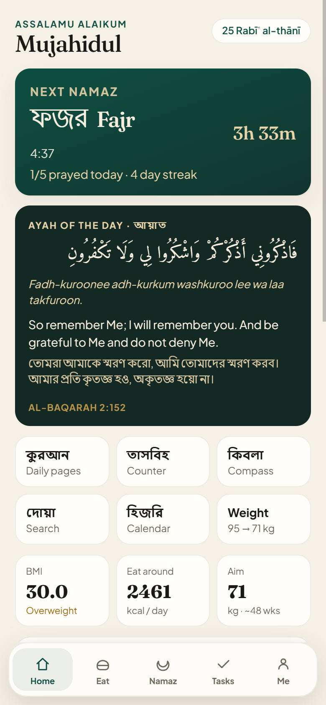
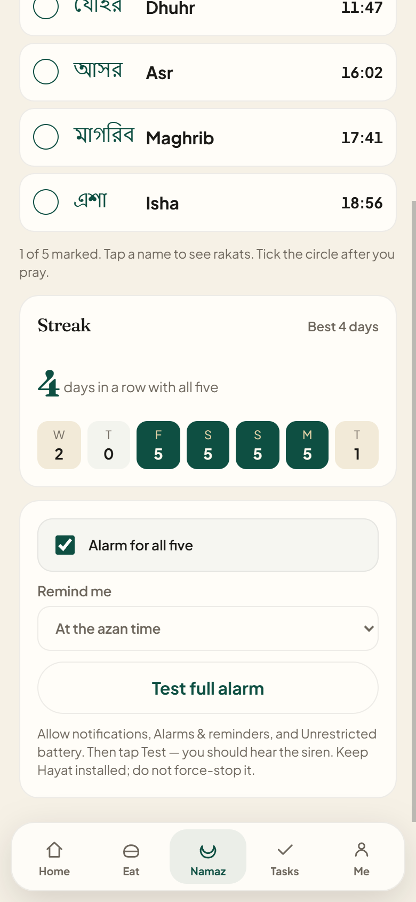
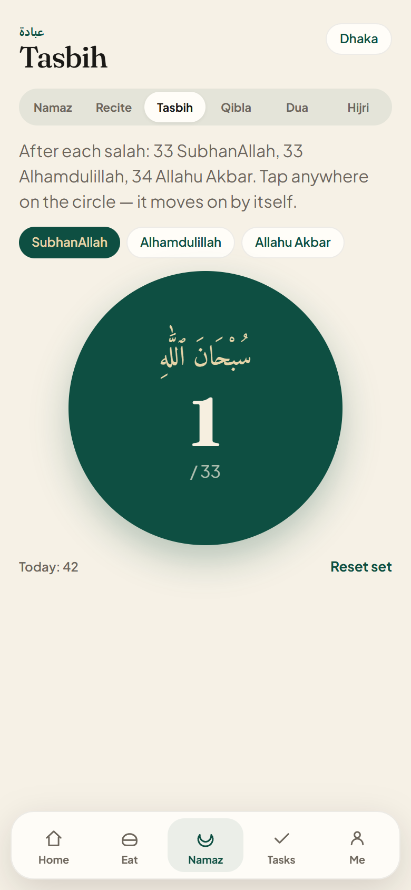
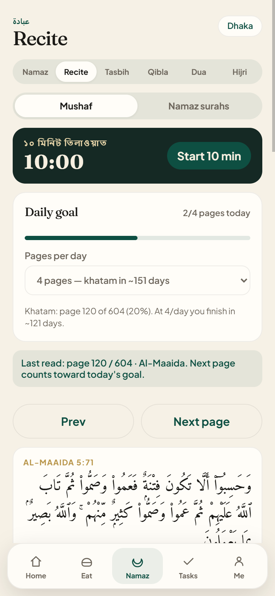
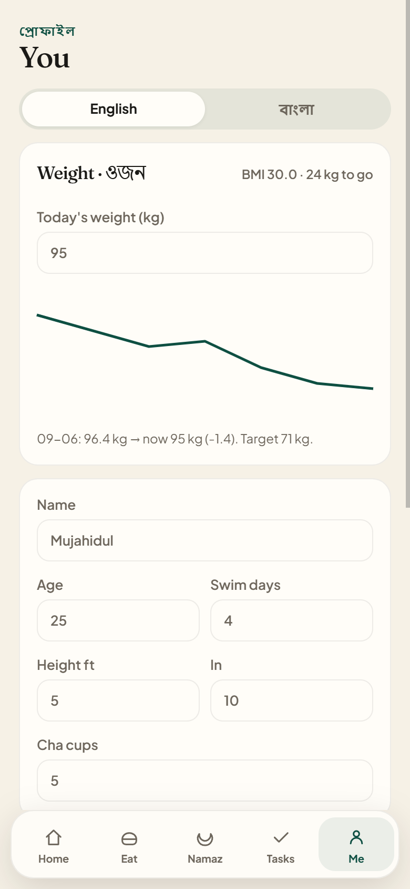
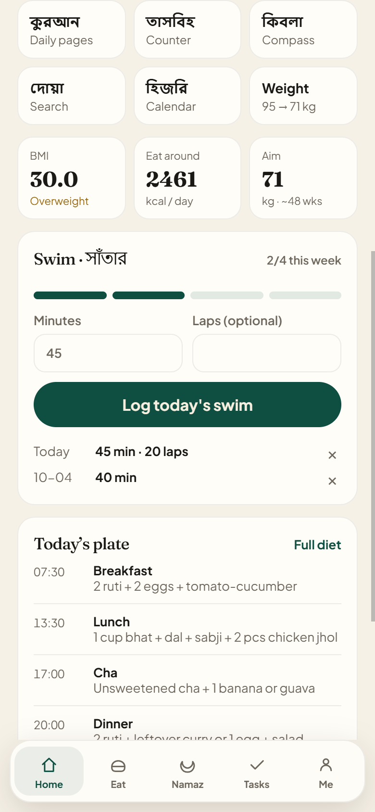
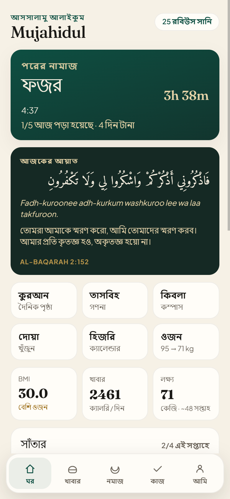
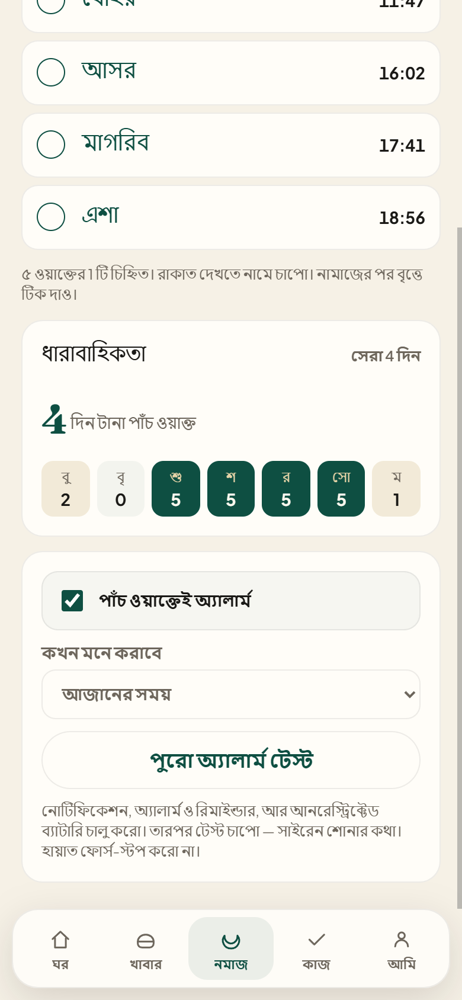

# Hayat · হায়াত

A daily-life app for a practicing Muslim in Bangladesh: namaz times and loud alarms, homemade Bangladeshi meal plans, weight and swim tracking, Quran reading goals, and a tasbih counter. It works in English or full Bangla.

Everything is stored on your phone. There is no account and no server.

<p align="center">
  
  
  
</p>

## Features

### Namaz

- Prayer times from your GPS, using the Karachi method with Hanafi Asr (the Islamic Foundation Bangladesh standard).
- Alarms that ring like a phone alarm, even when the app is closed (Android app).
- Tick each prayer after you pray. A **streak** counts days in a row with all five, and the last 7 days show at a glance.
- Tap a prayer name for a step-by-step Hanafi guide: rakats, what to recite, with Arabic, pronunciation, and Bangla.
- Qibla compass, dua search (English or Bangla), and a Hijri calendar with Suhoor and Iftar times in Ramadan.

### Quran and dhikr

- Read the Mushaf page by page with Bangla translation and transliteration. Your place is saved.
- **Daily goal**: choose 1 to 20 pages a day, see today's progress and how many days until your khatam.
- **Tasbih**: one big tap circle for 33 SubhanAllah, 33 Alhamdulillah and 34 Allahu Akbar. It moves to the next one by itself and vibrates.
- Offline pack of the short surahs used in salah.

### Body

- **Weight log** with a 30-entry trend chart and kg left to your target.
- **Swim tracker**: log minutes and laps, see swim days this week against your goal, and a weekly streak.
- Meal plan built from homemade Bangladeshi food (ruti, bhat, dal, fish, chicken, eggs), sized to your calories. Includes a weekly view and a bazaar list.
- Water glasses, cha reduction plan, and daily task reminders.

<p align="center">
  
  
  
</p>

### Bangla mode

Switch between English and বাংলা on the **Me** tab or on the first onboarding screen. Every screen, the meal plan, and notifications change language.

<p align="center">
  
  
</p>

## Install

### Android

Install the `Hayat.apk` file (allow "Install unknown apps" when asked). After installing, allow:

1. Notifications
2. Alarms & reminders
3. Unrestricted battery

Then open **Namaz → Test full alarm**. You should hear the siren.

### iPhone

iOS doesn't allow installing an app from a file. Use the web version instead:

1. Open the app's HTTPS link in **Safari**.
2. Tap **Share → Add to Home Screen**.

It then opens full screen like an app. Background alarms on iPhone are limited to what Safari allows. A real App Store build needs a Mac with Xcode; the Capacitor iOS project is already in `ios/`.

## Development

Requirements: Node.js 22 or newer. Android builds also need the Android SDK and JDK 21.

```bash
npm install
npm run dev          # http://localhost:5173
node src/check.js    # logic self-check
npm run build        # production build to dist/
```

| Script | What it does |
| --- | --- |
| `npm run android:sync` | Build and copy the web app into the Android project |
| `npm run ios:sync` | Build and copy the web app into the iOS project (build on a Mac) |
| `npm run build:pages` | Build with relative paths for GitHub Pages |

Build the Android APK after syncing:

```bash
cd android
./gradlew assembleDebug
# output: android/app/build/outputs/apk/debug/app-debug.apk
```

Pushing to `main` deploys the web version to GitHub Pages through `.github/workflows/pages.yml` (turn on Pages → GitHub Actions in the repo settings).

## Project layout

```
src/
  App.jsx      onboarding, Home, Eat, Namaz times, Tasks, Me
  ibadah.jsx   Quran reader, Tasbih, Qibla, Dua, Hijri, namaz guide
  lib.js       storage, diet math, prayer API, alarms, streaks, language
  namaz.js     Hanafi rakats, steps and recitations
  duas.js      dua library with English and Bangla tags
  check.js     runnable self-check
public/        PWA manifest, service worker, icons
android/       Capacitor Android project (native alarm plugin)
ios/           Capacitor iOS project
```

## Data sources

- Prayer times and Hijri dates: [Aladhan](https://aladhan.com/prayer-times-api)
- Quran text, Bangla translation and transliteration: [AlQuran Cloud](https://alquran.cloud/api)
- City name from GPS: [OpenStreetMap Nominatim](https://nominatim.org/)

Your data stays in the browser's local storage under `hayat.v1`. **Me → Start over** erases it.
